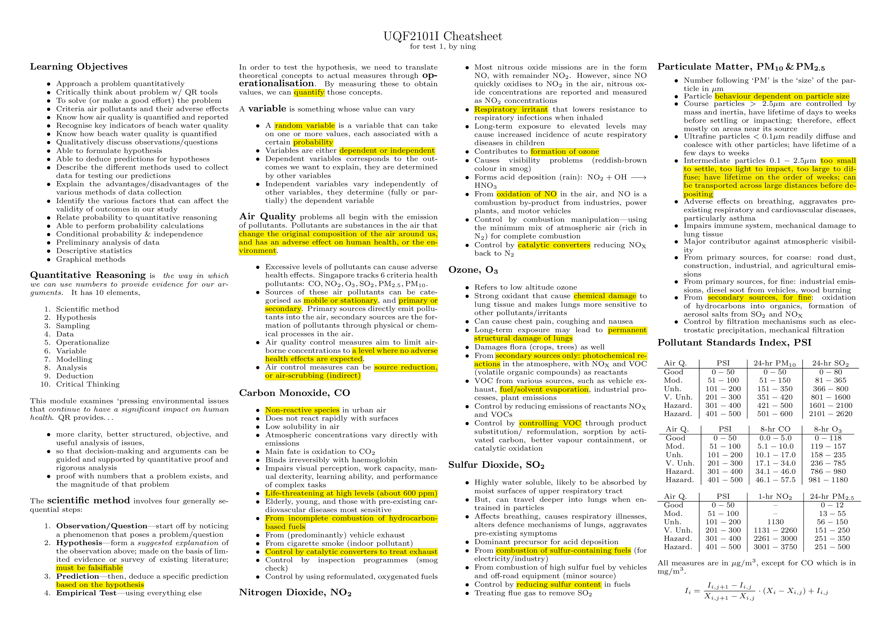
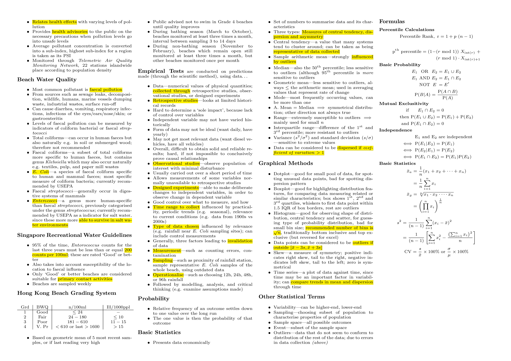
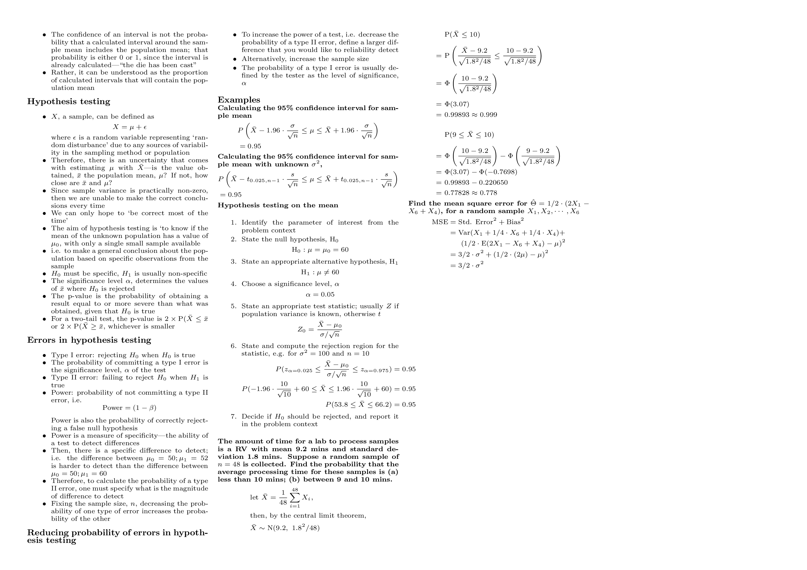

Cheatsheets
===========

1. `CS1101S Finals`_
2. `UQF2101I Test 1`_
3. `UQF2101I Test 2`_

CS1101S Finals
--------------

.. image:: docs/cs1101s-finals-2017s1-0.png
.. image:: docs/cs1101s-finals-2017s1-1.png

Prepared for AY2017/18 Sem 1. Includes documentation for inbuilt *source* functions, as it was announced that the exam paper would not provide said documentation. Written for a single piece of double-sided A4 paper, as per the limitation then.
`Download the PDF here
<https://github.com/ningyuansg/Cheatsheets/raw/master/pdf/cs1101s-finals-2017s1.pdf>`_.

UQF2101I Test 1
---------------

Prepared for AY2017/18 Sem 2. Written for a single piece of double-sided A4 paper for convenience (there was no restriction on amount of reference material).
`Download the PDF here
<https://github.com/ningyuansg/Cheatsheets/raw/master/pdf/uqf2101i-test1-2018s2.pdf>`_.

UQF2101I Test 2
---------------

.. image:: docs/uqf2101i-test2-2018s2-0.png

Prepared for AY2017/18 Sem 2. Written for a single piece of double-sided A4 paper for convenience (there was no restriction on amount of reference material).
`Download the PDF here
<https://github.com/ningyuansg/Cheatsheets/raw/master/pdf/uqf2101i-test2-2018s2.pdf>`_.
